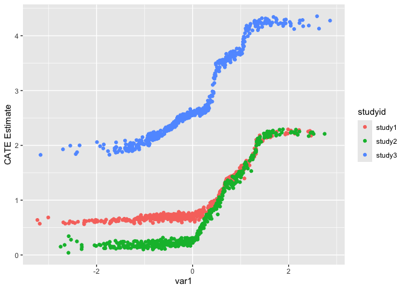
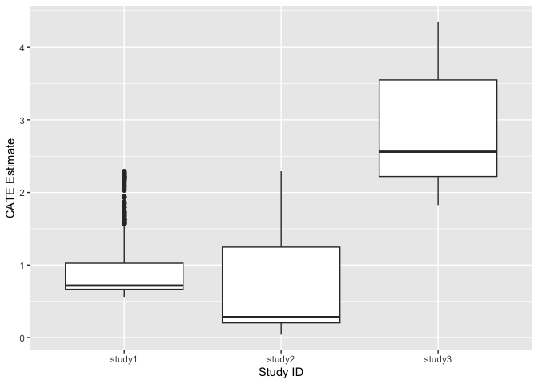
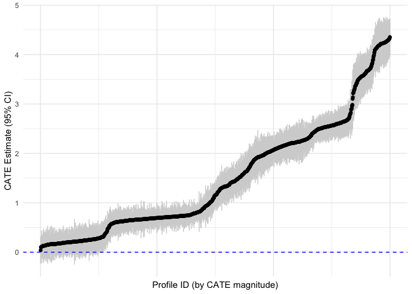
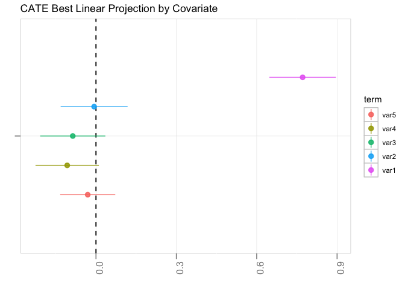
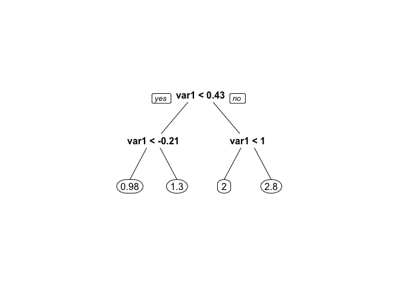
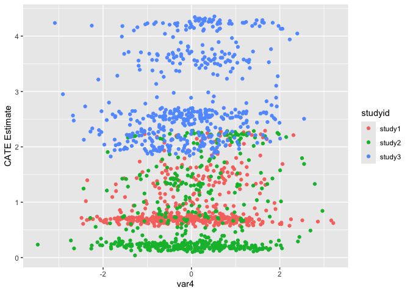

<!-- README.md is generated from README.Rmd. Please edit that file -->

# multicate

<!-- badges: start -->

[](https://lifecycle.r-lib.org/articles/stages.html#experimental)
[](https://github.com/dobengjhu/multicate/actions/workflows/R-CMD-check.yaml)
<!-- badges: end -->

The goal of multicate is to provide approaches to estimate the
conditional average treatment effect (CATE) across multiple studies, and
to predict the CATE in a target population of interest.

## Overview of Approach

This package includes code for methods that combine multiple studies to
estimate heterogeneous treatment effects, as outlined in Brantner et
al. (2024): <doi:10.1002/sim.9955>. The focal estimand of this work is
the CATE: $$\tau(X) = E(Y(1)-Y(0)|X)$$ where $Y$ is the outcome of
interest, $Y(1)$ and $Y(0)$ are the potential outcomes under treatment
and control, respectively, and $X$ are covariates that could be effect
moderators.

The primary function of the package is the estimate_cate() function,
used to estimate the conditional average treatment effect (CATE) across
multiple studies (which could be randomized controlled trials or
observational studies, or a combination of the two). The function relies
on an estimation method and an aggregation method; see function Details
for more.

## Installation

You can install the development version of multicate from
[GitHub](https://github.com/) with:

``` r
# install.packages("pak")
pak::pak("dobengjhu/multicate")
```

## Example

A researcher is interested in estimating the CATE across 10 previously
conducted trials that compared the same two treatments. The researcher
has 5 covariates that could be potential effect moderators.

``` r
library(multicate)
```

``` r
summary(dat)
#>    studyid                tx              var1               var2          
#>  Length:1500        Min.   :0.0000   Min.   :-3.23141   Min.   :-3.365264  
#>  Class :character   1st Qu.:0.0000   1st Qu.:-0.70526   1st Qu.:-0.652530  
#>  Mode  :character   Median :1.0000   Median :-0.08816   Median :-0.019049  
#>                     Mean   :0.5007   Mean   :-0.04349   Mean   :-0.009024  
#>                     3rd Qu.:1.0000   3rd Qu.: 0.63657   3rd Qu.: 0.633093  
#>                     Max.   :1.0000   Max.   : 2.86391   Max.   : 3.163110  
#>       var3               var4                var5             response      
#>  Min.   :-3.19499   Min.   :-3.479211   Min.   :-3.06869   Min.   :-7.7346  
#>  1st Qu.:-0.69529   1st Qu.:-0.683609   1st Qu.:-0.71471   1st Qu.:-0.6264  
#>  Median : 0.01517   Median :-0.008273   Median :-0.04481   Median : 1.0049  
#>  Mean   : 0.01449   Mean   :-0.015047   Mean   :-0.05777   Mean   : 1.1191  
#>  3rd Qu.: 0.71331   3rd Qu.: 0.642289   3rd Qu.: 0.61727   3rd Qu.: 2.7625  
#>  Max.   : 3.62987   Max.   : 3.212579   Max.   : 3.06603   Max.   :10.3940
```

One potential approach could be to use the estimate_cate() function with
a causal forest with pooling with trial indicator (as outlined in
Brantner et al., 2024). We will use this method, inputting our dataset,
selecting our estimation and aggregation method, and highlighting
columns to be used as our study indicator, treatment, outcome, and
covariates.

``` r
set.seed(100)
cate_mod <- estimate_cate(dat,
                          estimation_method = "causalforest",
                          aggregation_method = "studyindicator",
                          study_col = "studyid",
                          treatment_col = "tx",
                          outcome_col = "response",
                          covariate_col = c("var1", "var2", "var3", "var4", "var5"))

summary(cate_mod)
#> 
#> Estimation Method: causalforest
#> Aggregation Method: studyindicator
#> 
#> Variable Importance:
#>       studyid_study3      var1 studyid_study2       var4       var3       var2
#> Value      0.6198409 0.2510776     0.03040065 0.02422016 0.02182425 0.02123526
#>             var5 studyid_study1
#> Value 0.01985598     0.01154517
#> 
#> Overall ATE:
#>   Estimate Std. Error 
#>    1.50396    0.05103 
#> 
#> Study-Specific ATE:
#>        Minimum CATE Median CATE Maximum CATE
#> study1      0.56106      0.7172        2.291
#> study2      0.03956      0.2821        2.293
#> study3      1.82616      2.5626        4.356
```

The summary() function provides helpful summary information, including
variable importance (a measure of how involved each variable was in
creating the forest – see grf and ranger documentation for more details
on calculation), an estimate of the overall average treatment effect
(ATE) (in this case, a doubly robust estimate), and summaries of
study-specific CATE distributions.

Users can also directly output cate_mod to see more detailed
information, including cate_mod\$model which displays the original
dataset with columns added on to include CATE estimates ‘tau_hat’ and
variance estimates ‘variance_estimates’.

``` r
plot(cate_mod)
```



The plot functionality allows for several helpful visuals of the
resulting CATE model, including: - a histogram of CATE estimates across
individuals in the estimation studies - a boxplot of CATE estimates per
study - CATE estimates and 95% confidence intervals for all
individuals - a best linear projection of the CATE by covariates - an
interpretation tree of the CATE by covariates

``` r
plot_vteffect(cate_mod, covariate_name = "var1")
```


``` r
plot_vteffect(cate_mod, covariate_name = "var4")
```



The plot_vteffect() function can also be called to plot any covariate as
the X axis alongside CATE estimates in the Y axis. Points are
automatically colored by study membership. This plot is a helpful visual
to investigate how the CATE varies by a covariate of interest, as well
as how heterogeneous the CATE is by study.

Finally, suppose the researcher wants to use this model to predict the
CATE in a target population of interest. The researcher can use the
predict.cate() functionality to do so (see Details for more
information).

``` r
new_dat <- tibble::tribble(
  ~tx, ~var1,   ~var2,   ~var3,    ~var4,   ~var5,   ~response,
  0,   -0.728,  1.66,    -0.213,   -0.0621, 0.252,   1.26,
  0,   -0.464,  0.230,   0.579,    -1.17,   0.0513,  -0.235,
  0,   1.52,    -0.792,  0.951,    0.869,   -0.312,  1.42,
  0,   0.410,   -0.945,  -1.49,    -1.87,   -1.35,   -3.10,
  1,   -0.223,  2.20,    0.0242,   0.419,   0.333,   3.56,
  1,   -0.187,  -0.439,  -0.557,   -0.0679, 0.497,   0.0518,
  1,   1.41,    -0.830,  -0.306,   1.12,    0.648,   2.61,
  1,   -0.437,  1.22,    1.18,     -1.63,   -1.09,   0.833
)

predict(cate_mod, new_dat)
#> # A tibble: 8 × 10
#>      tx   var1   var2    var3    var4    var5 response tau_predicted pi_lower
#>   <dbl>  <dbl>  <dbl>   <dbl>   <dbl>   <dbl>    <dbl>         <dbl>    <dbl>
#> 1     0 -0.728  1.66  -0.213  -0.0621  0.252    1.26            1.02    -12.6
#> 2     0 -0.464  0.23   0.579  -1.17    0.0513  -0.235           1.08    -13.0
#> 3     0  1.52  -0.792  0.951   0.869  -0.312    1.42            2.84    -12.6
#> 4     0  0.41  -0.945 -1.49   -1.87   -1.35    -3.1             1.50    -13.6
#> 5     1 -0.223  2.2    0.0242  0.419   0.333    3.56            1.14    -14.6
#> 6     1 -0.187 -0.439 -0.557  -0.0679  0.497    0.0518          1.18    -14.1
#> 7     1  1.41  -0.83  -0.306   1.12    0.648    2.61            2.84    -12.4
#> 8     1 -0.437  1.22   1.18   -1.63   -1.09     0.833           1.10    -12.9
#> # ℹ 1 more variable: pi_upper <dbl>
```

The researcher can use the results of this function to better understand
what the CATE may be in the target population setting, and use this to
make informed decisions on which treatment may be preferable for the
given covariate profile.
